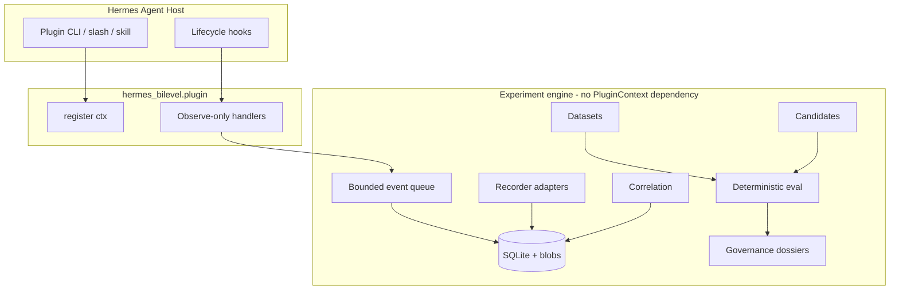

# hermes-bilevel

**Auditable bilevel optimization laboratory for [Hermes Agent](https://github.com/NousResearch/hermes-agent).**

Observe-only by default. No automatic promotion. No silent self-modification.
Provider-agnostic. Research-grade. Fail-closed.

> This is **not** a consciousness project, **not** recursive self-improvement,
> and **not** a prompt-mutating toy. It is an experimental framework for
> controlled optimization of agent mechanisms (skills/policies) with provenance.

## What it is / is not

| Is | Is not |
|----|--------|
| Observe-mode telemetry lab | Live agent mutator by default |
| Inner/outer loop experiment engine | Auto-RSI claim |
| Dataset/candidate/evaluation tooling | Single LLM-judge fitness |
| Promotion **dossier** generator | Automatic production promotion |
| Hermes plugin + standalone CLI | Hermes core fork |

## Safety status (v0.1)

Default config:

- `mode: observe`
- `model_calls.enabled: false`
- `optimization.enabled: false`
- `promotion.enabled: false` / `automatic: false`
- `wire: false`
- `network.outbound_enabled: false`
- `recording.content_mode: metadata_only`

Activation of paid model calls, live inner episodes, shadow candidates,
injection, and promotion each require **separate explicit gates**.

## Architecture (thin plugin, thick engine)



## Install

```bash
# editable
python3.11 -m venv .venv && source .venv/bin/activate
pip install -e ".[dev]"

# or user plugin directory (directory plugin layout)
# ln -s "$(pwd)" ~/.hermes/plugins/bilevel
# hermes plugins enable bilevel
```

### Pip entry point

```toml
[project.entry-points."hermes_agent.plugins"]
bilevel = "hermes_bilevel.plugin:register"
```

Enable (Hermes 0.19.x):

```bash
hermes plugins enable bilevel
# or configure plugins.entries.bilevel.enabled: true
```

Exact enable semantics depend on Hermes config; discovery ≠ activation.

## First five minutes

```bash
hermes-bilevel init --json
hermes-bilevel doctor --json
hermes-bilevel selftest --json
hermes-bilevel status --json
```

Metadata-only observation activates when the plugin is enabled in Hermes —
hooks record hashes/shapes, not raw prompts by default.

## Manual candidate offline path

```bash
hermes-bilevel dataset build --name demo --split inner_train --tasks examples/tasks/demo_tasks.json --lock --json
hermes-bilevel candidate import examples/candidates/demo_candidate.json --json
hermes-bilevel experiment run --candidate examples/candidates/demo_candidate.json --tasks examples/tasks/demo_tasks.json --json
hermes-bilevel dossier --candidate examples/candidates/demo_candidate.json --results /tmp/result.json --json
```

## Grok 4.5

See [docs/GROK_4_5.md](docs/GROK_4_5.md). Model proposals use Hermes host-owned
LLM interface only, dual-gated (`model_calls.enabled` + `--allow-model-call`).
v0.1 ships the interface + test double; paid proposal runs are v0.2 scope.

## Privacy warning

Default recording is **metadata_only**. Full content requires explicit config
and still runs redaction when enabled. See [docs/PRIVACY.md](docs/PRIVACY.md).

## Limitations

- Hooks alone cannot prove exact provider-boundary fidelity.
- Live promotion is dossier-only in v0.1 (`NOT_IMPLEMENTED_BY_DESIGN`).
- Network isolation of tempdir sandbox is reported as `UNKNOWN` unless an
  OS-level isolation backend is used.
- Windows symlink/worktree behavior needs CI validation.

## Docs

- [Architecture](docs/ARCHITECTURE.md)
- [Bilevel model](docs/BILEVEL_MODEL.md)
- [Security](docs/SECURITY.md) / [Threat model](docs/THREAT_MODEL.md)
- [Hermes compatibility audit](docs/HERMES_COMPATIBILITY_AUDIT.md)
- [Research claims](docs/RESEARCH_CLAIMS.md)
- [Upstream submission](docs/UPSTREAM_SUBMISSION.md)

## License

MIT — see LICENSE.

## Citation

See CITATION.cff.
